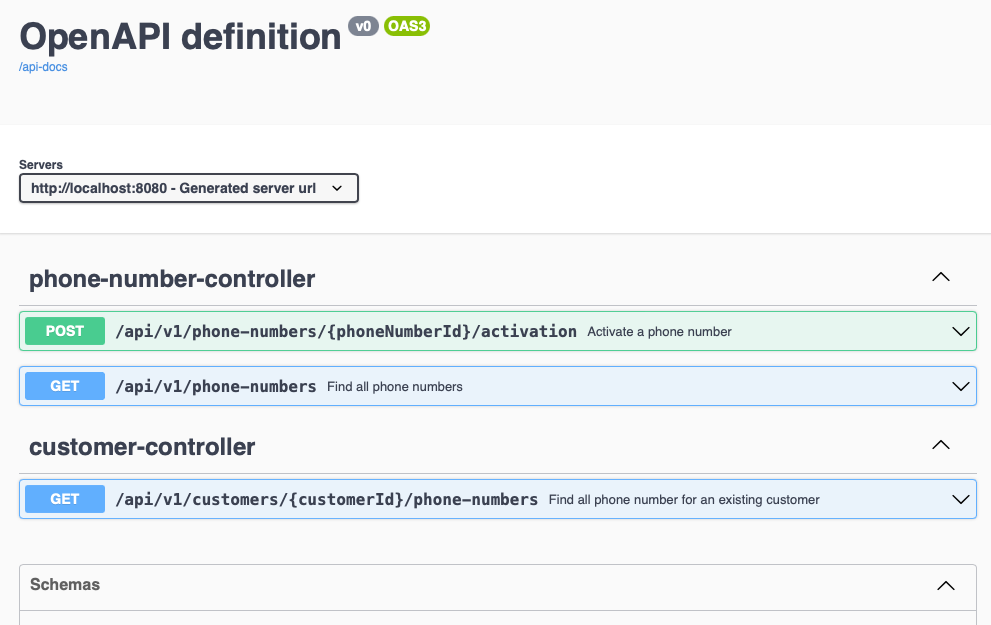

# Phone Number Service

Testing project focuses on API contract design and function development, to avoid over complex, assume:

* Domain model reflects main biz data, not  storage level flexibility      
* Load testing data to H2 DB for demo purpose
* Some technical areas are out scope, e.g. authentication and authorisation, CORS, etc.

## Run project

```bash
./mvnw clean spring-boot:run
```

### API Spec

Swagger UI - http://localhost:8080/swagger-ui.html

Swagger JSON - http://localhost:8080/api-docs

Swagger YAML - http://localhost:8080/api-docs.yaml



## Design

### Packages/Modules

* `controller` - Handing HTTP request and invoke service to complete the job 
* `dto` - API data model
* `service` - application service handling business process with support from domain objects
* `domain` - domain object

### Note

* `LoadData.ts` - init testing data into H2 db for demo
* `Customer` and `PhoneNumber` are loosely coupled, no table join
* Testing
  * API integration test: `CustomerControllerIT.java` and `PhoneNumberControllerIT.java`
  * DB component integration test: `PhoneNumberRepositoryIT.java` and `CustomerRepositoryIT.java`
  * Left are unit test (*Test.java)
* Operation
  * http://localhost:8080/actuator/health